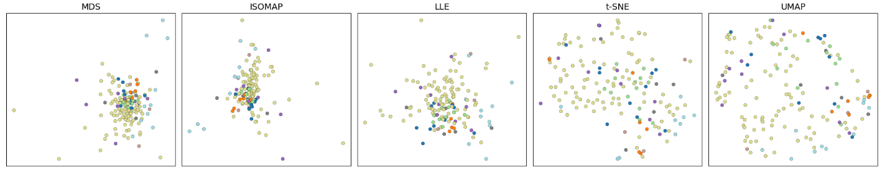
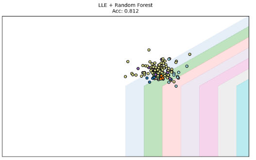

# 📊 Financial Manifold Learning / Сравнение алгоритмов снижения размерности на данных NYSE

[](https://www.python.org/)
[](https://jupyter.org/)
[](https://scikit-learn.org/)
[](LICENSE)
[](https://colab.research.google.com/github/VeronikaKolimova/financial-manifold-learning/blob/main/L_04_release_02.ipynb)
[](https://mybinder.org/v2/gh/VeronikaKolimova/financial-manifold-learning/HEAD?labpath=L_04_release_02.ipynb)

**EN:** Comparative study of manifold learning techniques (MDS, t-SNE, UMAP, ISOMAP, LLE) applied to NYSE financial data.

**RU:** Сравнительное исследование методов снижения размерности (MDS, t-SNE, UMAP, ISOMAP, LLE) на данных NYSE.


## 🚀 Quick Start / Быстрый старт

###  Local Installation / Локальная установка

```bash
# Clone repository
git clone https://github.com/your-username/financial-manifold-learning.git
cd financial-manifold-learning

# Create virtual environment (optional)
python -m venv venv
source venv/bin/activate  # On Windows: venv\Scripts\activate

# Install dependencies
pip install -r requirements.txt

# Launch Jupyter
jupyter notebook
```
A comprehensive machine learning project exploring dimensionality reduction techniques applied to NYSE financial data. This repository demonstrates how to transform high-dimensional financial metrics into 2D/3D visualizations using various manifold learning algorithms.

## Features
- Data preprocessing pipeline for financial datasets
- Implementation of 5 dimensionality reduction methods:
  - MDS (Multidimensional Scaling)
  - ISOMAP
  - LLE (Locally Linear Embedding)
  - t-SNE (t-Distributed Stochastic Neighbor Embedding)
  - UMAP (Uniform Manifold Approximation and Projection)
- Interactive visualization of financial clusters
- Comparative analysis of different algorithms

## Technologies
- Python 3.8+
- scikit-learn, UMAP-learn
- pandas, numpy
- matplotlib, seaborn
- Jupyter Notebook

## Use Cases
- Exploratory data analysis of financial markets
- Comparative study of dimensionality reduction techniques
- Educational resource for manifold learning
- Template for financial data visualization projects

##  Результаты

### Сравнение методов снижения размерности

*Цвета отражают отраслевую принадлежность компаний (8 классов)*

### Лучшая модель классификации


*LLE + Random Forest: Accuracy = 0.812, F1 (macro) = 0.553*

### Сравнение метрик моделей

| Method | Model           | Accuracy | F1 (weighted) | F1 (macro) |
|--------|-----------------|----------|---------------|------------|
| MDS    | Decision Tree   | 0.500    | 0.479         | 0.238      |
| MDS    | Random Forest   | 0.562    | 0.469         | 0.107      |
| ISOMAP | Decision Tree   | 0.625    | 0.543         | 0.165      |
| ISOMAP | Random Forest   | 0.625    | 0.552         | 0.255      |
| LLE    | Decision Tree   | 0.750    | 0.668         | 0.410      |
| LLE    | Random Forest   | 0.812    | 0.731         | 0.553      |
| t-SNE  | Decision Tree   | 0.688    | 0.631         | 0.239      |
| t-SNE  | Random Forest   | 0.688    | 0.562         | 0.257      |
| UMAP   | Decision Tree   | 0.688    | 0.688         | 0.543      |
| UMAP   | Random Forest   | 0.688    | 0.636         | 0.403      |
